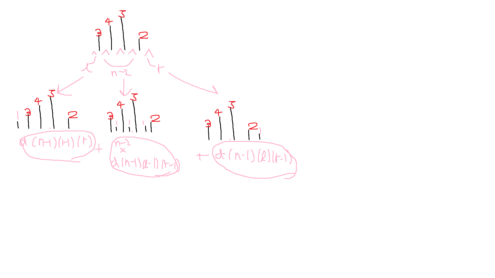

# 문제 : [고층빌딩](https://www.acmicpc.net/problem/1328)

# 풀이
- 점화식 :  d[i][j][k] = d[i-1][j-1][k]+d[i-1][j][k-1] + (i-2)*d[i-1][j][k]  
- d[n][l][r] : 빌딩 n개, 왼쪽에서 l개 보이고, 오른쪽에서 r개 보이는 빌딩 배치의 경우의 수  
- 가장 왼쪽에 높이 1의 빌딩이 위치하는 경우  
  - l이 하나 증가한다 -> d[n-1][l-1][r] 
- 가장 오른쪽에 높이 1의 빌딩이 위치하는 경우  
  - r이 하나 증가한다 -> d[n-1][l][r-1]  
- 양 끝을 제외하고 높이 1의 빌딩이 위치하는 경우(n - 2가지의 수)  
  - l, r 둘다 1씩 증가한다 -> d[n-1][l-1][r-1] * (n-2)  

  
  

```python
n,l,r = map(int,input().split())
MAX = 101
MOD = 1000000007
d = [[[0]*MAX for _ in range(MAX)] for _ in range(MAX)]
d[1][1][1] = 1

for i in range(2,n+1):
    for j in range(1,l+1):
        for k in range(1,r+1):
            d[i][j][k] = d[i-1][j-1][k]+d[i-1][j][k-1] + (i-2)*d[i-1][j][k]

print(d[n][l][r] % MOD)

```
