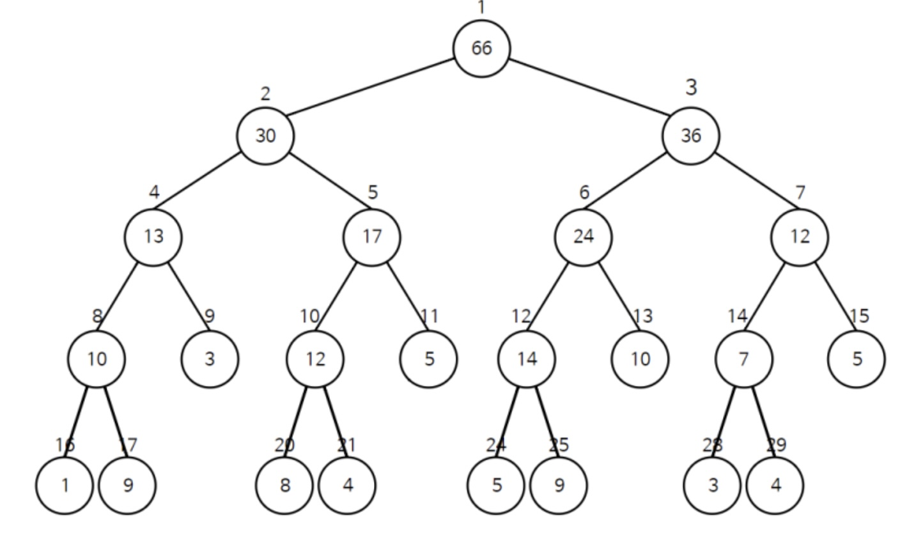
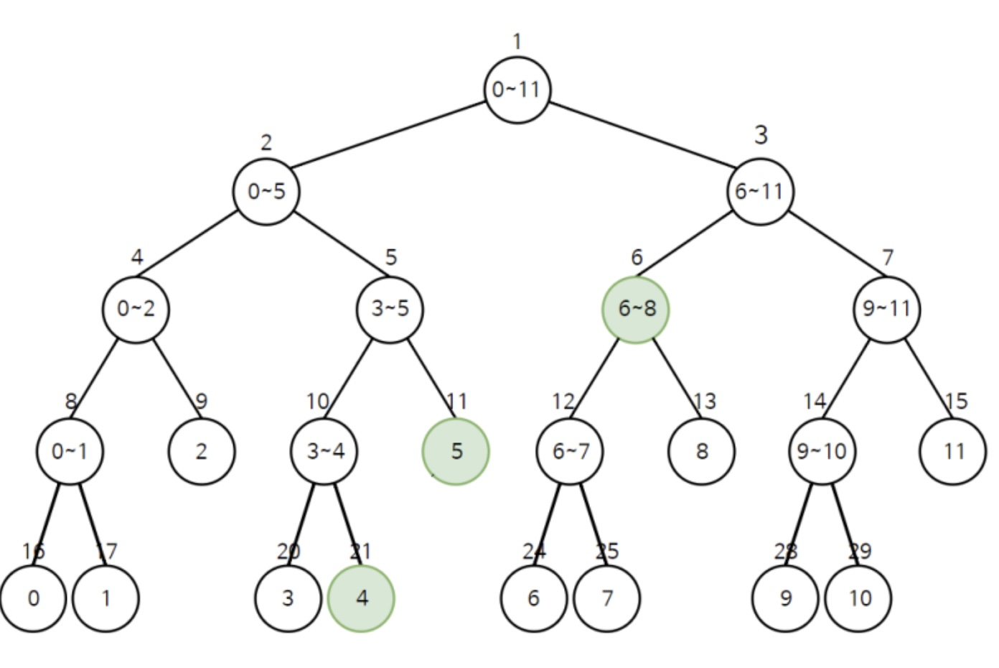
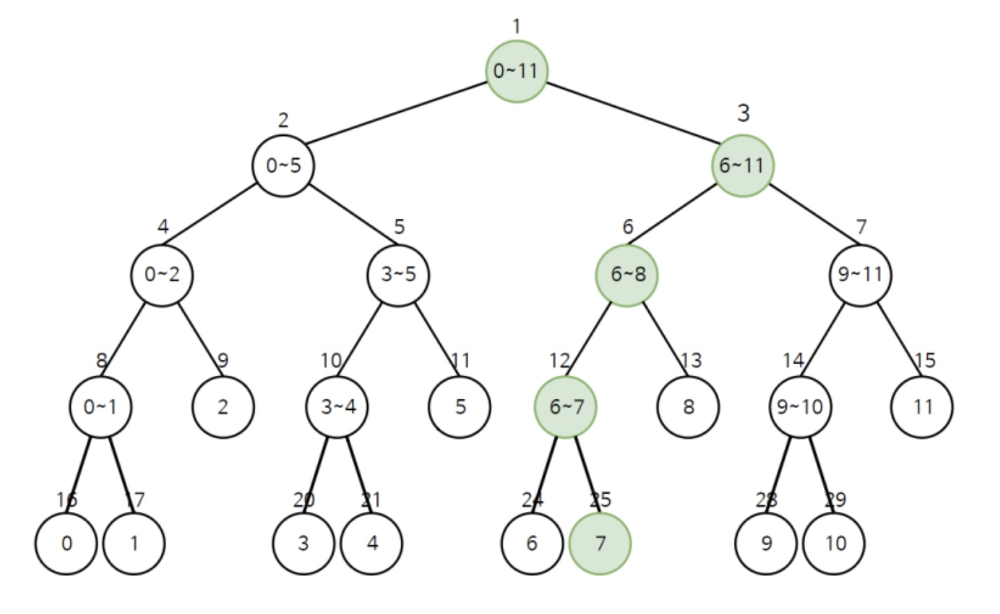

[참고 블로그: 안경잡이 개발자](https://m.blog.naver.com/ndb796/221282210534)  
[참고 블로그 ](https://ojt90902.tistory.com/532)
# 세그먼트 트리


여러 개의 데이터가 다음과 같이 존재할 때 특정 구간의 합을 구하는 방법에 유용한  
세그먼트 트리에 대해 알아보자!!  
트리 영역에서 세그먼트 트리는 매우 중요하다.  

## 배열에서 특정 구간 합 구하기!   

방법 1: 선형적으로 구하기 - O(N) 설명 생략  
방법 2: premix 기법 사용하기 

방법 3: 트리 구조를 이용하여 구하기 - O(logN)

ex) arr = [5,8,7,3,2,5,1,8,9,8,7,3]  

  
[출처]:(https://m.blog.naver.com/ndb796/221282210534)  

# 1.  구간 합 트리 생성 하기  

이제, 구간 합을 빠르게 구하기 위해 새로운 구간합 트리를 만들어주자!!  

위의 배열의 index는 0~11의 값을 갖는다.  

1) 최상단 노드 1에 구간(0,11)의 원소들의 합인 66을 부여한다. 

2) (중요 - 분할)  

>원래 데이터의 범위를 절반씩 분할하여 그 구간의 합들을 저장하도록 초기 설정한다.  

mid = (0+11)/2 = 5. 

구간 (0,11)을 (0, 5) ,(6,11)로 분할 한 후,
왼쪽 자식 노드 (1x2)와 오른쪽 자식 노드 (1x2 + 1)에 (0,5)의 구간합과 (6,11)의 구간합을 각각 부여한다.  

2번 과정을 반복하면(leaf노드가 나올 때까지) 다음과 같은 구간합 트리를 생성할 수 있다.  


  
[출처]:(https://m.blog.naver.com/ndb796/221282210534)  


구간합 트리의 초기 설정을 할 때, 구간 합 트리의 공간을 할당해야 하는데  

먼저, 위의 구간 합 트리의 노드 개수는 29개인데, 15번 노드의 자식들이 모두 있었다면 32개의 데이터 공간(0번 노드 포함)이 필요하다.  

이는, N개의 길이를 갖는 arr가 있을 때, N보다 큰 가장 가까운 제곱수 X2까지 배열을 미리 만들어 놓아야 한다는 것이다.  
ex) n = 12 -> (제곱수) = 16 -> 32(= 트리의 노드 개수)  

실제 구간합 트리를 구현할 때, 공간을 Nx4만큼 미리 트리의 공간에 할당하면 충분하다!!  

이제 구간 합 트리의 초기 설정 및 생성을 파이썬으로 구현하겠다.  


```python
# 0. 구간 합 트리 초기 설정

n = 12 # nums 배열의 길이
nums = [5,8,7,3,2,5,1,8,9,8,7,3]  # 숫자를 담는 배열

tree = [0]*(4*n)
```


```python
# 1. 구간 합 트리 구하기

def init(l,r,node):
    # leaf노드
    if l == r:
        tree[node] = nums[l]
        return tree[node]

    # 구간 반으로 쪼개기
    mid = (l + r) // 2
    # 왼쪽 자식, 오른쪽 자식 구한 후 합쳐 node의 val값 구하기
    left_child = init(l,mid, node*2)
    right_child = init(mid+1 , r, node*2 +1)
    tree[node] = left_child + right_child
    return tree[node]
```

# 2. 구간 합 트리 탐색 후 구간합 구하기  

이제 구간 합 트리를 구하였으니, 원하는 범위의 구간합을 구해보자  
트리의 구조를 가지고 있기 때문에, 데이터를 탐색하는데 걸리는 시간은 O(logN)을 보장한다.  

ex) (4,8)의 범위에 해당하는 합을 구하시오 -> 3개의 노드에 해당하는 값만 더하면 된다.

  

이제, 파이썬으로 트리에서 구간 합을 구하는 함수를 구한 후, 위의 간단한 예제를 테스트하겠다.  

아래, 소스코드를 볼 때, 왜 3가지 case로 나누었는지 생각하면서 보자  

> -> 범위 안에 있는 경우만 더해주면 된다.


```python
# 2. 구간 합 트리 탐색

# 현재 노드 , 노드의 범위 (s,e)
# 구하고자 하는 구간합 범위(l,r)
def query(node,s,e,l,r):
    # 범위 밖에 있는 경우
    # 1)(l,r) 범위 밖에 (s,e)가있는 경우 - (즉, 겹치는 구간이 없음)
    if r < s or e < l: return 0
    
    # 범위 안에 있는 경우
    # 2)(l,r) 범위 안에 (s,e)가있는 경우 - (즉, (s,e)은 (l,r)의 부분집합이다.)
    if l <= s and e <= r: return tree[node]

    # 3) 그 외의 경우 - 분할!
    mid = (s+e) // 2

    ans = query(2*node, s,mid,l,r) + query(2*node+1,mid+1,e,l,r)
    return ans
```

## Test 1


```python
init(0,11,1)
l,r = 4,8
print(tree)
print(query(1,0,11,l,r)) # 2+5+1+8+9 = 25
```

    [0, 66, 30, 36, 20, 10, 18, 18, 13, 7, 5, 5, 9, 9, 15, 3, 5, 8, 0, 0, 3, 2, 0, 0, 1, 8, 0, 0, 8, 7, 0, 0, 0, 0, 0, 0, 0, 0, 0, 0, 0, 0, 0, 0, 0, 0, 0, 0]
    25


# 3. 특정 원소 값을 수정하기

특정 원소 값을 수정하는 방법은 크게 2가지가 있는데  
한 가지는 트리내 수정하고자 하는 원소의 index가 포함된 모든 노드들의 원소값을 새로운 원소값으로 바꾸는 것이고,  
또 다른 한가지는, dif = 수정 원소값 - 기존 원소값 을 세팅 후 해당 모든 노드들에 dif을 더해주는 것이다.  

정리)  
> 두 가지 방법 모두 O(logN)의 시간복잡도를 보장한다.  
> 특정 원소값을 수정할 때, 해당 원소를 포함하고 있는 모든 구간의 합 노드들을 갱신해준다.  
> 결국, 이번에도 범위안에 있는 경우만 수정이 해당된다.  

ex) 배열 내 index7의 원소를 수정한다고 하면, 트리내 구간 합 노드 5개를 수정해주어야 한다.  



```python
# 특정 원소값 수정하기

# idx : 해당 원소 인덱스 값 , dif = 수정할 값 - 기존 원소 값
def update(node,s,e,idx, dif):
    # 범위 밖
    if idx<s or e < idx : return
    # 범위 안
    # index값에 해당하는 노드
    if s == idx == e:
        tree[node] += dif
        return
    # 나머지 케이스(범위 안)
    tree[node] += dif
    mid = (s+e) // 2
    update(node*2,s, mid,idx,dif)
    update(node*2+1 ,mid +1 , e, idx, dif)
```

# Test2


```python

# nums[idx]값 수정 후 , 트리 내 노드도 수정
idx = 7
change = 10
dif = 10 - nums[idx] # 10 - 8
nums[idx] = 10
# 업데이트 전
print(tree[1], tree[3], tree[6],tree[12], tree[25])
# 66 36 18 9 8
update(1,0,11,idx,dif)
print(tree[1], tree[3], tree[6],tree[12], tree[25])
# 68 38 20 11 10 잘 바뀐 모습
```

    66 36 18 9 8
    68 38 20 11 10


# 전체 소스 코드


```python
# 1. 구간 합 트리 구하기
def init(l,r,node):
    # leaf노드
    if l == r:
        tree[node] = nums[l]
        return tree[node]

    # 구간 반으로 쪼개기
    mid = (l + r) // 2
    # 왼쪽 자식, 오른쪽 자식 구한 후 합쳐 node의 val값 구하기
    left_child = init(l,mid, node*2)
    right_child = init(mid+1 , r, node*2 +1)
    tree[node] = left_child + right_child
    return tree[node]

# 2. 구간 합 트리 탐색

# 현재 노드 , 노드의 범위 (s,e)
# 구하고자 하는 구간합 범위(l,r)
def query(node,s,e,l,r):
    # 1)(l,r) 범위 밖에 (s,e)가있는 경우
    if r < s or e < l: return 0

    # 2)(l,r) 범위 안에 (s,e)가있는 경우
    if l <= s and e <= r: return tree[node]

    # 3) 그 외의 경우
    mid = (s+e) // 2

    ans = query(2*node, s,mid,l,r) + query(2*node+1,mid+1,e,l,r)
    return ans

# 특정 원소값 수정하기

# idx : 해당 원소 인덱스 값 , dif = 수정할 값 - 기존 원소 값
def update(node,s,e,idx, dif):
    # 범위 밖
    if idx<s or e < idx : return
    # 범위 안
    # index값에 해당하는 노드
    if s == idx == e:
        tree[node] += dif
        return
    # 나머지 케이스(범위 안)
    tree[node] += dif
    mid = (s+e) // 2
    update(node*2,s, mid,idx,dif)
    update(node*2+1 ,mid +1 , e, idx, dif)
# Test
n = 12 # nums 배열의 길이
nums = [5,8,7,3,2,5,1,8,9,8,7,3]  # 숫자를 담는 배열

tree = [0]*(4*n)

init(0,11,1)
l,r = 4,8
# 2+5+1+8+9 = 25
print(query(1,0,11,l,r)) # 25

# nums[idx]값 수정 후 , 트리 내 노드도 수정
idx = 7
change = 10
dif = 10 - nums[idx] # 10 - 8
nums[idx] = 10
# 업데이트 전
print(tree[1], tree[3], tree[6],tree[12], tree[25])
# 66 36 18 9 8
update(1,0,11,idx,dif)
# 업데이트 후
print(tree[1], tree[3], tree[6],tree[12], tree[25])
# 68 38 20 11 10 잘 바뀐 모습
```

    25
    66 36 18 9 8
    68 38 20 11 10

