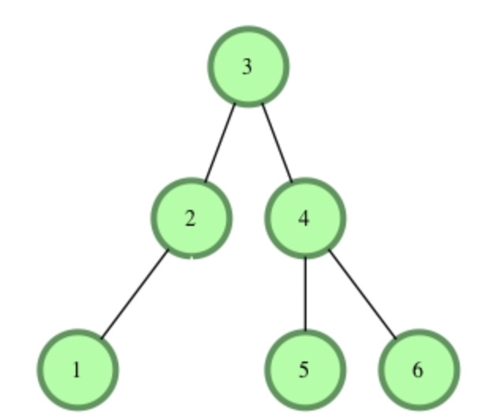

https://www.geeksforgeeks.org/a-program-to-check-if-a-binary-tree-is-bst-or-not/m  

[참고](https://www.youtube.com/watch?v=zhhxBrtaOO0)

# BST 판별하는 방법  

[Haker Rank: 연습문제- 구현 후 여기서 실행](https://www.hackerrank.com/challenges/ctci-is-binary-search-tree/problem?h_l=interview&isFullScreen=true&playlist_slugs%5B%5D=interview-preparation-kit&playlist_slugs%5B%5D=trees)

BST 구현은 다른 포스팅에서 자세히 설명했으므로, 생략하겠습니다.

# 틀린 풀이 


```python
def checkBST(root):
    now = root
    
    # now X
    if now is None:
        return True
    
    # now O
    if now.left and now.data  < now.left.data: return False
    if now.right and now.right.data < now.data: return False
    
    if not checkBST(now.left) or not checkBST(now.right): return False
    
    return True
```

반례:  

  


# BST 판별 방법 1

BST를 inorder(L-N-R) 순회하였을 때, 그 결과 값은 모든 노드값을 오름차순한 결과값과 같다.  
따라서, inorder 순회를 하며, 배열에 노드값을 순회에 따라 넣어주고, 그 배열이 오름차순이면 True, 아니면 False  

## 예시
  
위의 그림에서 BST를 inorder 했을 때, 1 2 3 4 5 6으로 나오고 이 값을 arr에 넣어준다.  
arr = [1,2,3,4,5,6] -> True  

마찬가지로 위에 Chapter: 틀린 풀이의 그림에서 Tree에도 동일 과정 수행  
arr = [1,2,4,3,5] -> False  


이제 파이썬으로 소스코드 구현


```python
def Inorder(root,arr): # 인오더 함수
    if root is None:
        return 
    
    if root.left:
        Inorder(root.left,arr)
    
    arr.append(root.data)
    
    if root.right:
        Inorder(root.right,arr)
    
    return arr


def checkBST(root):
    arr= []
    arr = Inorder(root,arr) 
    # 해당 arr가 오름차순인지 판별
    for i in range(1,len(arr)-1):
        if arr[i] <= arr[i-1]: # 문제에서, 중복 허용 x (중복 허용하면 <)
            return False
    return True
```

총 O(N)의 시간 복잡도를 갖는 풀이이다.  
그러나, arr생성하여, O(N)만큼 추가로 공간복잡도를 갖게 된다.  
다음 판별 방법은 이 점을 개선한 방법이다.

# BST 판별 방법 2

위에 1번 판별방법에서, N크기의 arr를 생성한 점을 보완한 풀이이며, inorder 순회를 활용한 점은 같다.  
어차피 우리가 필요한건, 현재 값과 그 전의 값을 비교하는 것이다.  
따라서 pre라는 변수를 하나 만들어 트리를 순회하면서 노드값과 비교하며, pre를 갱신해준다.


```python
pre = 0
flag = True # pre >= node값 인 경우 False를 담기 위한 boolen 변수
def checkBST(root):
    global flag
    Inorder(root)
    return flag


def Inorder(root):
    global flag,pre
    
    if flag == False:
        return 
    if root is None:
        return
    
    # L
    if root.left:
        Inorder(root.left)
    # N
    if not pre: # pre가 비었으면, 노드값 할당
        pre = root.data
    elif pre : 
        if pre < root.data: # 오름차순 check -> pre값 갱신
            pre = root.data
        else: # 오름 차순 x -> flag False
            flag = False
    # R
    if root.right:
        Inorder(root.right)
```

# BST 판별 방법 3 

이번 BST 판별 방법은 root 노드에서 자식 방향으로 내려가면서 해당 node가 가질 수 있는 영역(범위)를 제한하는 방법이다.  

범위 제한 방법  
> 각 노드에 대해 왼쪽 서브트리의 최대값이 노드보다 작은지 오른쪽 서브트리의 최소값이 노드보다 큰지 확인합니다.

  

위 그림으로 예시를 들겠다.  
1. min_val, max_val 의 초기값을 세팅한다.(이때, 중복되는 값으로 초기값으로 잡으면 안된다.)  


2. root(=3)의 왼쪽 서브 트리로 내려갈 때는 root.left(=2)로 root를 갱신, max_val = 3으로 최댓값을 갱신해주고,  
   root(=3)의 오른쪽 서브 트리로 내려갈 때는 root.right(=4)로 root를 갱신, min_val = 3으로 최솟값을 갱신해준다.  
   
... 해당 서브트리도 2번의 과정을 root가 None일 때까지 반복  

3. 해당 root.data값이 min_val보다 크고, min_val보다 작으면 True를 반환, 범위를 벗어나면 False를 반환해준다.


```python
import sys


def checkBST(root,MIN_VAL= -sys.maxsize, MAX_VAL= sys.maxsize): # boolen

    # root x
    if root is None: return True

    # case 1: 범위 밖 - 중복 허용 x (허용 하면 < , > 빼기)
    if root.data <= MIN_VAL or MAX_VAL <= root.data: return False
    
    # case 2: L서브트리 ,R서브트리 재귀호출하여 BST 진위판별
    if not checkBST(root.left, MIN_VAL, root.data) or not checkBST(root.right, root.data, MAX_VAL):
        return False
    
    # case 1, case 2 통과하면 BST이다.
    return True
```

# 정리 및 주의점

문제에서 수의 중복을 허용하는지 안하는지를 주의깊게 볼 것!  -(이에 따라 코드가 달라진다.)  
보통 수의 중복을 허락하지 않는 경우가 더 많은 것 같다.. 경험상??
또한, 메모리와 시간제한 또한 확인하여 무슨 방법으로 문제를 풀지 결정하자.  

